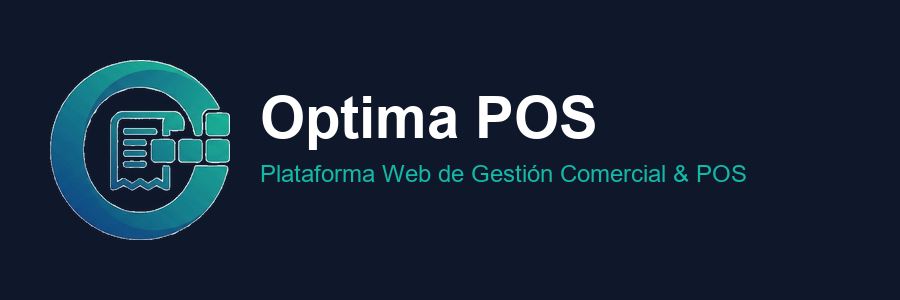
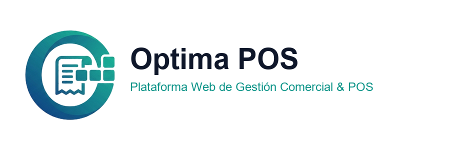
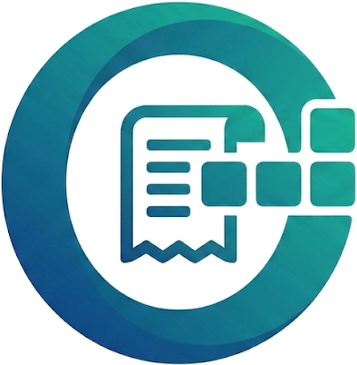

# 🎨 Manual de Identidad de Marca — Optima POS

> **Versión 1.0 | Guía de Estándares Gráficos y Comunicación Visual**  
> *Sistema POS Cloud moderno, modular y de alto rendimiento diseñado para la gestión comercial integral, Punto de Venta (POS), control de inventarios y auditoría operativa en tiempo real.*

---

## 1. Visión & Filosofía de Marca

**Optima POS** es la solución tecnológica diseñada para impulsar la eficiencia operativa y comercial de comercios minoristas y tiendas al detal. Nuestra identidad de marca transmite cuatro pilares fundamentales:

1. **Optimización & Precisión**: Control riguroso de caja, inventarios y márgenes en tiempo real.
2. **Modernidad Modular**: Arquitectura limpia, ágil e intuitiva que se adapta al ritmo de crecimiento del negocio.
3. **Resiliencia & Confianza**: Funcionamiento ininterrumpido (Offline-First) y seguridad de datos.
4. **Claridad Comercial**: Interfaz transparente, enfocada en la experiencia del usuario y en métricas claras.

---

## 2. Muestras Oficiales de la Marca

A continuación se presentan los activos gráficos oficiales de la marca:

### A. Isologo Completo (Con Texto)





* **Composición**: Isotipo emblemático "O" + Nombre corporativo "Optima POS" + Descriptor de plataforma ("Sistema POS Cloud de Gestión Comercial").
* **Uso Principal**: 
  * Pantalla principal de inicio de sesión (*Login Page*).
  * Documentación corporativa, manuales, propuestas de software y contratos.
  * Encabezados de informes ejecutivos y exportaciones de comprobantes PDF/Word.
  * Banners de presentación, firmas digitales y sitio web oficial.

---

### B. Isotipo Limpio (Sin Texto / Imagotipo)



* **Composición**: Emblema circular en gradiente verde-esmeralda con el recibo de caja y los bloques modulares.
* **Uso Principal**:
  * Favicon e ícono de la pestaña del navegador.
  * Avatar de perfil y barra lateral de navegación compacta (*Sidebar*).
  * Ícono de aplicación web progresiva (PWA / App Móvil).
  * Botones de acción, marcas de agua y redes sociales.

---

## 3. Análisis Simbólico del Isotipo

El isotipo reúne tres elementos conceptuales integrados en una sola figura geométrica sólida:

| Elemento Gráfico | Concepto Simbólico | Significado para la Marca |
| :--- | :--- | :--- |
| **La Anilla Circular "O"** | La letra inicial **O** de *Optima* en un trazo envolvente. | Representa el ciclo continuo de optimización, fluidez operativa y cobertura integral del negocio. |
| **El Recibo Térmico (Ticket)** | Símbolo central de transacción con bordes dentados. | Representa la agilidad en la facturación, la precisión en Punto de Venta (POS) y la honestidad contable. |
| **Los Bloques Modulares** | Módulos interactivos conectándose al núcleo. | Representa la arquitectura modular del sistema, la sincronización en la nube (Cloudflare R2/Supabase) y el control de inventarios. |

---

## 4. Paleta de Colores Corporativa

La paleta cromática se basa en tonos oceánicos profundos y verdes esmeralda tecnológicos, transmitiendo equilibrio entre solidez financiera y modernidad digital:

### Colores Principales

```
┌───────────────────────────┬───────────────────────────┐
│ Teal Esmeralda (Primary)  │ Slate Corporativo (Dark)  │
│ HEX: #0D9488              │ HEX: #0F172A              │
│ RGB: rgb(13, 148, 136)    │ RGB: rgb(15, 23, 42)      │
│ HSL: 173°, 84%, 32%       │ HSL: 222°, 47%, 11%       │
└───────────────────────────┴───────────────────────────┘
```

| Tono / Aplicación | Código HEX | Código RGB | Descripción y Uso |
| :--- | :--- | :--- | :--- |
| **Primary (Teal Esmeralda)** | `#0D9488` | `13, 148, 136` | Color principal de marca. Usado en botones primarios, enlaces activos e íconos de énfasis. |
| **Slate Dark (Fondo Oscuro)** | `#0F172A` | `15, 23, 42` | Color de estructura. Usado en el menú lateral (*Sidebar*), paneles principales de login y textos de alto contraste. |
| **Teal Light (Accent)** | `#14B8A6` | `20, 184, 166` | Tono de realce para alertas de éxito, métricas positivas y badges. |
| **Surface Neutral (Superficie)**| `#F8FAFC` / `#FFFFFF` | `248, 250, 252` | Colores de fondo de tarjetas, tablas y contenido ejecutable. |
| **Text Dark (Texto)** | `#1E293B` | `30, 41, 59` | Color primario para lectura de párrafos y títulos principales. |

### Gradiente Corporativo (*Flat Ocean & Emerald*)
* **Definición CSS**: `linear-gradient(135deg, #0F172A 0%, #0D9488 100%)`
* **Uso**: Fondos de tarjetas destacadas, encabezados de login y la silueta principal del logotipo.

---

## 5. Tipografía Corporativa

La marca utiliza una familia tipográfica Sans-Serif de corte geométrico, diseñada para optimizar la legibilidad en pantallas táctiles y monitores de alta resolución:

### 1. Tipografía de Marca y Titulares (*Display Font*)
* **Fuente**: *Plus Jakarta Sans* / *Inter* (o fallback `system-ui, -apple-system`).
* **Pesos recomendados**: `Bold (700)` y `ExtraBold (800)`.
* **Uso**: Logotipo, títulos de páginas, indicadores numéricos clave (KPIs) y encabezados de modales.

### 2. Tipografía de Cuerpo de Texto (*Body Font*)
* **Fuente**: *Inter* / *Roboto* (o fallback `sans-serif`).
* **Pesos recomendados**: `Regular (400)` y `Medium (500)`.
* **Uso**: Tablas de productos, descripciones, formularios de configuración y mensajes de sistema.

### 3. Tipografía Numérica y Moneda (*Monospace Font*)
* **Fuente**: `JetBrains Mono` / `ui-monospace` / `monospace`.
* **Uso**: Folios de venta (`V-2026-00001`), montos de moneda (`$45.220`), códigos de barras (SKUs) y RFC/NIT.

---

## 6. Área de Aislamiento & Tamaños Mínimos

Para asegurar el impacto visual del logotipo en cualquier medio, se deben respetar las siguientes dimensiones mínimas y márgenes de seguridad:

### Área de Protección
* Alrededor del logotipo o isotipo debe mantenerse un espacio libre equivalente a la altura de la letra **"O"** del emblema (`1X`), libre de textos, bordes o elementos gráficos competidores.

### Tamaños Mínimos Recomendados

| Aplicación | Isotipo Limpio | Isologo Completo |
| :--- | :--- | :--- |
| **Interfaz Web / Pantallas** | `24px x 24px` | `120px x 36px` |
| **Favicon / App Icon** | `16px x 16px` | N/A |
| **Impresión / Tickets Térmicos**| `12mm x 12mm` | `45mm x 15mm` |

---

## 7. Usos Correctos e Incorrectos (Do's & Don'ts)

### ✅ Usos Correctos
- Usar el **Isotipo Limpio** en avatares, favicons y menús laterales compactos.
- Usar el **Isologo Completo** sobre fondos oscuros corporativos (`#0F172A`) o fondos blancos limpios.
- Conservar la proporción de aspecto cuadrada (1:1) en el recuadro del logotipo con bordes redondeados (`rounded-2xl`).

### ❌ Usos Incorrectos
- **No deformar ni estirar** la relación de aspecto del isotipo.
- **No alterar la paleta cromática** (por ejemplo, cambiar el gradiente verde-esmeralda a tonos rojos o amarillos de advertencia).
- **No encerrar el isotipo en rectángulos blancos rígidos** sobre superficies oscuras; siempre utilizar la versión transparente o contenedores de cristal estilo *glassmorphism*.
- **No colocar texto secundario que compita** con la tipografía oficial de la marca.

---

> [!NOTE]
> Este manual de identidad garantiza la consistencia visual de **Optima POS** tanto en el sistema POS Cloud como en materiales impresos, comprobantes térmicos y documentación corporativa.
